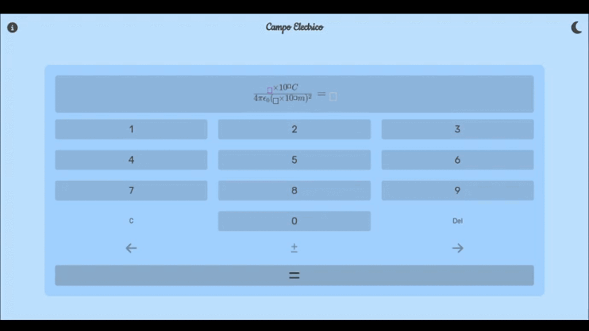

# Eletric Field Calculator

This is a WebSite to Calc the Electric Field, project elaborated to Physic's Area from University.

## Features

* Theme Dark and light ☀️/🌙
* Information about electric field ℹ️
* Responsive Design 📱

## Preview



---

## How to deploy in local

First, clone with git the repository:

```bash
git clone https://github.com/kiddhermez/Calculator.git
```

Now, start the server:

```bash
cd Calculator
npm dev start
```

Open [http://localhost:3000](http://localhost:3000) with your browser to see the result.

## Web on Versel

the webpage is pre-deploy thanks to Versel and is located to [this link](https://calculator-bay-delta.vercel.app)


---

## Usage

Put the Charge and his Exponential Value on the first and secod fields respectively, and the radius and his Exponential Value on the third and four places.

You can move with the left and right arrows, and push any number to put the value in the screen (only one digit per space), when all felds are full you can press equal's button to know an aproximidity to the result

If you press the C button all fields will be reset, and if you press Del the digit on the selected field will be erased

with the plus-minus button you can change the sign to the selected field.

---

## knowledge

* [React](https://reactjs.org/)
* [Next.js](https://nextjs.org/)
* [Vercel](https://vercel.com/)
* [Tailwind](https://tailwindcss.com)
